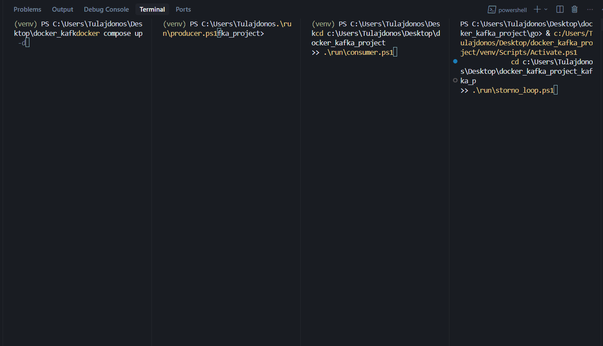

# Kafka House Triplet Pipeline

A Python producer and Go consumer that send and receive correlated "house triplets" over Apache Kafka. Each triplet consists of three messages (foundation, wall, roof) with matching IDs, emitted across 3 topic partitions. The consumer joins them by ID and writes JSONL output.



---

## Hogyan működik? (A történet)

Először elindítod a Kafkát – ez egy üzenetközpont, ami a háttérben fut, és várja az üzeneteket. Olyan, mint egy postahivatal: fogadja a küldeményeket, és tárolja őket, amíg valaki el nem jön érte.

Aztán elindul a **Producer** – ez egy Python program, ami három „munkást” indít egyszerre. Mindegyik munkás egy ház egy-egy részét készíti: az első az alapot (foundation), a második a falat (wall), a harmadik a tetőt (roof). Minden másodpercben száz vagy ezer ilyen háromszoros üzenetet küldenek a Kafkának, és minden három rész ugyanazzal a számmal (ID) van megjelölve – így később össze tudjuk őket rakni.

A Kafka három külön „fiókba” (partition) teszi az üzeneteket: az alapok az egyikbe, a falak a másikba, a tetők a harmadikba kerülnek. Így párhuzamosan dolgozhatnak, és nem keverednek össze.

Közben elindul a **Consumer** – ez egy Go program, ami figyeli mind a három fiókot egyszerre. Amikor egy üzenet megérkezik, kiolvassa a rajta lévő ID-t, és egy belső „asztalra” teszi: „Ez az 5-ös ház alapja, ez a falja, ez a tetője.” Amint mind a három rész megvan ugyanahhoz az ID-hoz, összerakja őket egy teljes házba, és beleírja a `houses.jsonl` fájlba – soronként egy ház, JSON formátumban.

Ha valaki „stornóz” egy házat – vagyis jelezni szeretné, hogy azt a házat ne vegyük figyelembe –, akkor egy másik csatornán (a `house-storno` topic) érkezik az üzenet. A consumer ezt is figyeli, és ha egy ház stornózva van, azt nem a normál listába írja, hanem külön egy `storno_houses.jsonl` fájlba – így mindig tudjuk, mely házak „érvénytelenek”.

A consumer emlékszik arra is, hol tartott: melyik üzenetnél járt az egyes fiókokban. Ezt a `consumer_offsets.json` fájlba menti. Ha a program leáll és újraindul, onnan folytatja, ahol abbahagyta – nem kezdi elölről az egészet.

Összefoglalva: a Producer három részre bontja a házakat és a Kafkának küldi, a Consumer összegyűjti őket, összerakja, és fájlokba írja – a Kafka pedig közben a postahivatal szerepét tölti be, ami biztonságosan tárolja az üzeneteket.

---

## Project Structure

```
docker_kafka_project/
├── config.yaml          # Kafka, producer, consumer configuration
├── docker-compose.yml   # Apache Kafka (KRaft mode)
├── requirements.txt     # Python dependencies
├── README.md
├── src/
│   └── gif/             # Demo GIF
│       └── docker_kafka_test_2.gif
├── python/              # Python source code
│   ├── producer_partitioned.py   # 3-partition producer (main)
│   ├── producer.py               # Simple producer
│   ├── consumer.py               # Simple consumer
│   ├── storno_producer.py        # Storno producer (single storno)
│   └── storno_loop.py            # Periodic storno loop (test)
├── go/                  # Go source code
│   ├── main.go          # Triplet-joining consumer
│   ├── go.mod
│   └── go.sum
├── run/                 # Startup scripts
│   ├── kafka.ps1        # Start Kafka
│   ├── producer.ps1     # Start producer
│   ├── consumer.ps1     # Start consumer
│   ├── reset.ps1        # Clear output + delete Kafka topics
│   ├── stop.ps1         # Stop producer/consumer processes
│   ├── storno.ps1       # Single storno (by ID)
│   └── storno_loop.ps1  # Periodic storno loop
└── output/              # Consumer output (generated at runtime)
    ├── houses.jsonl     # Triplet JSONL output
    ├── storno_houses.jsonl
    ├── storno_ids.json
    └── consumer_offsets.json  # Crash-safe offset file (consumer_group: false)
```

---

## Prerequisites

- **Docker Desktop 4.58.0** (or compatible) – for running Apache Kafka
- **Python 3.10+** – for the producer
- **Go 1.21+** – for the consumer

---

## Installation

```powershell
# Create and activate virtual environment
python -m venv venv
.\venv\Scripts\Activate.ps1
pip install -r requirements.txt
```

---

## How to Start the Project

Run these commands from the **project root** (`docker_kafka_project/`). Use **two terminals**: one for the consumer, one for the producer.

### Terminal 1 – Kafka

```powershell
cd c:\Users\Tulajdonos\Desktop\docker_kafka_project
.\run\kafka.ps1
```

Or:
```powershell
cd c:\Users\Tulajdonos\Desktop\docker_kafka_project
docker compose up -d
```

### Terminal 2 – Consumer (start first)

```powershell
cd c:\Users\Tulajdonos\Desktop\docker_kafka_project
.\run\consumer.ps1
```

### Terminal 3 – Producer

```powershell
cd c:\Users\Tulajdonos\Desktop\docker_kafka_project
.\run\producer.ps1
```

### Terminal 4 (optional) – Storno loop

Periodically stornos random houses to test producer + consumer + storno together:

```powershell
cd c:\Users\Tulajdonos\Desktop\docker_kafka_project
.\run\storno_loop.ps1
```

> **Note:** The producer script activates the venv automatically. Start the consumer first, then the producer. The producer sends ~200–1000 msg/s per partition (configurable). Completed triplets are written to `output/houses.jsonl`.

---

## Technical Details

### Kafka & Docker

- **Image:** `apache/kafka:latest`
- **Mode:** KRaft (no Zookeeper)
- **Bootstrap:** `127.0.0.1:9092`
- **Topic:** `teszt-partitioned` (3 partitions)
- **Listeners:** `PLAINTEXT://0.0.0.0:9092`, controller on `9093`
- **Advertised:** `PLAINTEXT://127.0.0.1:9092` (use `127.0.0.1` for local clients)
- **Memory:** `KAFKA_HEAP_OPTS: "-Xmx1G -Xms512M"` – a coordinator stabilitáshoz (consumer_group mode esetén)

### Producer

- 3 threads, one per partition
- ~1000 messages/second per partition (configurable via `config.yaml`)
- Snappy compression, `linger_ms=5`, `batch_size=32768`
- Message format: `partition_N|id:X|ts:TIMESTAMP|name:NAME|task:TASK`

### Consumer

- Reads from all 3 partitions (simple consumer, reliable)
- **Offset persistence:** Saves last read position per partition to `output/consumer_offsets.json`; on restart, continues from where it left off
- Joins messages by ID into triplet (foundation + wall + roof)
- Writes JSONL to `output/houses.jsonl`
- Configurable: `flush_every`, `log_every`, `output_file`

### Offset File – Crash Safety

The offset file is written in a crash-safe way:

1. **Write to temp file** (`consumer_offsets.json.tmp`)
2. **`Sync()`** – flushes data to disk
3. **`Rename`** – atomic rename to final filename

If the process crashes during write, the original `consumer_offsets.json` stays intact. On restart, the consumer uses the last valid state. Delete `output/consumer_offsets.json` to re-read from the beginning.

### Alternative Offset Solutions

| Method | Description | Pros | Cons |
|--------|-------------|------|------|
| **File (current)** | Offset stored in JSON file | Simple, no extra dependencies, works with any Kafka setup | Single consumer only, file must be writable |
| **Kafka Consumer Group** | Kafka stores offsets in `__consumer_offsets` topic | Built-in, automatic, scales to multiple consumers | Requires KRaft/Kafka 2.8+; use `config.yaml` → `consumer_group: true` |
| **Database** | Store offsets in PostgreSQL, MySQL, etc. | Shared state, transactional, queryable | Extra dependency, more complex |
| **Redis** | Store offsets in Redis | Fast, shared across instances | Extra service, persistence config needed |

### Crash Safety (Output & Shutdown)

The consumer is designed for safe shutdown and minimal data loss:

1. **Signal handling:** Listens for `SIGINT` (Ctrl+C) and `SIGTERM`
2. **Graceful shutdown:** On signal, stops new processing and flushes buffers
3. **Immediate flush:** After each triplet write → `Flush()` + `Sync()` (no window between write and disk)
4. **Exit flush:** Before exit, flushes remaining buffer and calls `Sync()` so data reaches disk
5. **Shutdown sequence:** `Flush()` → `Sync()` → `Close()` on the output file

With `flush_every: 1`, every triplet is synced immediately. For higher throughput use `flush_every: 100` (trade-off: up to 99 triplets may be lost on abrupt crash).

### Időzített offset mentés

- `offset_save_interval_sec` – háttérben 30 mp-enként menti a `consumer_offsets.json`-t
- Csökkenti az adatvesztést crash esetén (az `flush_every` mellett)
- `0` = kikapcsolva

### Consumer Group vs. fájl alapú offset

| `consumer_group` | Offset tárolás | Storno szűrés | Stabilitás |
|------------------|----------------|---------------|------------|
| `false` | `consumer_offsets.json` | ✅ Igen | ✅ Stabil |
| `true` | Kafka `__consumer_offsets` | ❌ Nincs (tripletHandler nem használja) | ✅ Stabil (Metadata.RefreshFrequency fix) |

**Consumer Group partition assignment:** Sarama alapból 10 percig cache-eli a metadata-t. Ha a topic a consumer előtt jön létre (pl. producer előbb fut), vagy a group törlése után gyorsan indul a consumer, elavult metadata miatt csak 1 partition kerülhet assignment-re. A `Metadata.RefreshFrequency = 5s` biztosítja, hogy a balance során friss partition lista legyen. A `consumer.ps1` indulás előtt törli a group-ot, így mind a 3 partition hozzárendelődik.

### Optimalizációk (Go consumer)

| Terület | Megvalósítás | Hatás |
|---------|--------------|-------|
| **parseMsg** | `strings.Split` + `strconv.ParseInt` regex helyett | Gyorsabb parsing |
| **offset save** | `json.Marshal` (kompakt) `MarshalIndent` helyett | Kevesebb I/O |
| **eviction** | Egy iteráció a min ID keresésére | Fél O(n) |
| **storno save** | 100 ms debounce – nem minden üzenetnél ment | Kevesebb fájl I/O |
| **storno/offset** | `strconv` a `fmt.Sscanf` helyett | Gyorsabb konverzió |

---

## Configuration (`config.yaml`)

```yaml
kafka:
  bootstrap_servers: "127.0.0.1:9092"
  topic: "teszt-partitioned"
  num_partitions: 3

producer:
  msgs_per_sec: 1000
  compression_type: "snappy"
  linger_ms: 5
  batch_size: 32768

consumer:
  output_file: "../output/houses.jsonl"
  flush_every: 1        # 1 = max crash safety, 100 = gyorsabb
  log_every: 1000
  offset_save_interval_sec: 30   # időzített offset mentés (0 = kikapcsolva)
  consumer_group: true    # true = Kafka offset (Metadata.RefreshFrequency fix), false = fájl offset
```

---

## Stopping

- **Producer/Consumer:** Ctrl+C (handled gracefully)
- **Kafka:** `docker compose down`
- **Stop all:** `.\run\stop.ps1` – stops producer and consumer processes

## Reset

Clear output folder and delete Kafka topics (fresh start):

```powershell
.\run\reset.ps1
```

Use `-KeepKafka` to keep topics: `.\run\reset.ps1 -KeepKafka`

### Reset offsets (Consumer Group mode)

When `consumer_group: true`, offsets are stored in Kafka. To reset and re-read from the beginning:

```powershell
docker exec -it docker_kafka_project-kafka-1 /opt/kafka/bin/kafka-consumer-groups.sh --bootstrap-server localhost:9092 --group house-triplet-consumer --topic teszt-partitioned --reset-offsets --to-earliest --execute
```
